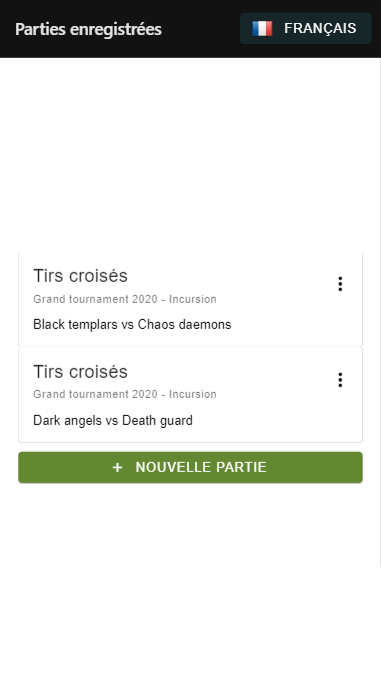
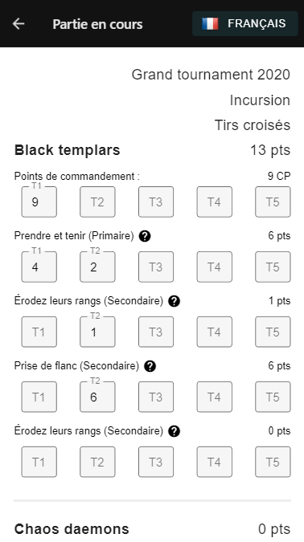
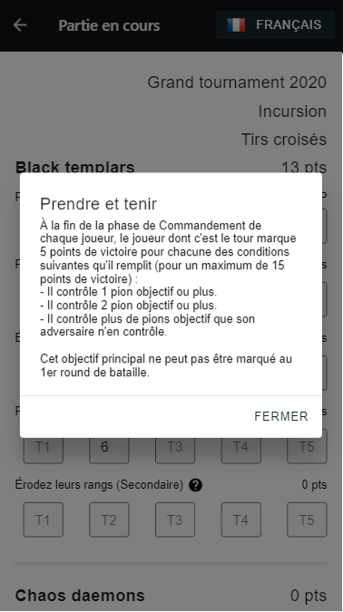

<!-- PROJECT SHIELDS -->
<!--
*** I'm using markdown "reference style" links for readability.
*** Reference links are enclosed in brackets [ ] instead of parentheses ( ).
*** See the bottom of this document for the declaration of the reference variables
*** for contributors-url, forks-url, etc. This is an optional, concise syntax you may use.
*** https://www.markdownguide.org/basic-syntax/#reference-style-links
-->
[![Issues][issues-shield]][issues-url]
[![MIT License][license-shield]][license-url]


<!-- PROJECT LOGO -->
<br />
<p align="center">
  <a href="https://github.com/p-bizouard/WH-40k-Matched-Play-V9">
    
  </a>

  <h3 align="center">WH-40k Matched Play V9</h3>

  <p align="center">Composition and score tracking of a Warhammer 40k game in V9</p>
</p>


<!-- TABLE OF CONTENTS -->
## Table of Contents

* [About](#about)
* [Getting Started](#getting-started)
  * [Prerequisites](#prerequisites)
  * [Installation](#installation)
* [License](#license)
* [Contact](#contact)


<!-- ABOUT THE PROJECT -->
## About

  <p align="center">
    Configure your Warhammer 40k games by entering your mission, armies, and objectives, then track the score via a summary screen!
  </p>

  <p align="center">
    <a href="https://www.wh40kobjectives.ovh/">Web demo</a> - <a href="https://play.google.com/store/apps/details?id=com.bizouard.wh_v9_objectives">Play store</a>
  </p>
  
  <p align="center">
    
    
    
    
    
    
  </p>

### Built With
* [Expo](https://expo.io/)
* [React native](https://reactnative.dev/)
* [Paper](https://github.com/callstack/react-native-paper)
* [react-intl-universal](https://github.com/alibaba/react-intl-universal)


<!-- GETTING STARTED -->
## Getting Started

### Prerequisites

This is an example of how to list things you need to use the software and how to install them.
* expo
```sh
npm install -g expo-cli
```
* formatjs
```sh
npm install -g formatjs
```
* eslint
```sh
npm install -g eslint
```

### Installation

1. Clone the repo
```sh
git clone https://github.com/p-bizouard/WH-40k-objectives.git
```
2. Install NPM packages
```sh
npm install
```
3. Compile translations
```sh
npm run compile-translations
```
4. Run expo
```sh
npm run web
```


<!-- LICENSE -->
## License

Distributed under the GNU General Public License v3.0. See `LICENSE` for more information.


<!-- CONTACT -->
## Contact

P-Bizouard : wh.40k.objectives@gmail.com

Project Link: [https://github.com/p-bizouard/WH-40k-Matched-Play-V9](https://github.com/p-bizouard/WH-40k-Matched-Play-V9)


<!-- MARKDOWN LINKS & IMAGES -->
<!-- https://www.markdownguide.org/basic-syntax/#reference-style-links -->
[issues-shield]: https://img.shields.io/github/issues/p-bizouard/WH-40k-Matched-Play-V9.svg?style=flat-square
[issues-url]: https://github.com/p-bizouard/WH-40k-Matched-Play-V9/issues
[license-shield]: https://img.shields.io/github/license/othneildrew/Best-README-Template.svg?style=flat-square
[license-url]: README.md
